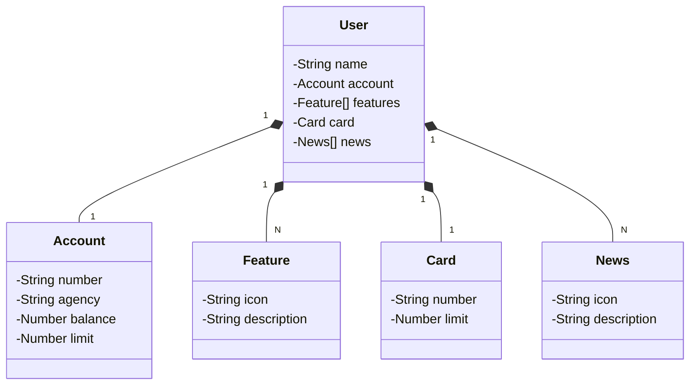

# Projec Santander Dev Week Java API [1^]

RESTful API da Santander Dev Week construída em Java 17 com Spring Boot 3.

## Principais Tecnologias
 - **Java 17**;
 - **Spring Boot 3**;
 - **Spring Data JPA**;
 - **OpenAPI (Swagger)**;
 - **Railway**: facilita o deploy e monitoramento da solução na nuvem, além de oferecer diversos bancos de dados como serviço e pipelines de CI/CD.

## [Link do Figma](https://www.figma.com/file/0ZsjwjsYlYd3timxqMWlbj/SANTANDER---Projeto-Web%2FMobile?type=design&node-id=1421%3A432&mode=design&t=6dPQuerScEQH0zAn-1)

O Figma foi utilizado para a abstração do domínio desta API, sendo útil na análise e projeto da solução.

## Diagrama de Classes (Domínio da API)

## Documentação da API (Swagger)

### [https://sdw-2023-prd.up.railway.app/swagger-ui.html](https://sdw-2023-prd.up.railway.app/swagger-ui.html)

### IMPORTANTE

Desenvolvimento da tela inicial do App do Santander (Figma)
- URL de Produção: https://sdw-2023-prd.up.railway.app/users/1
- Mock (Backup): https://digitalinnovationone.github.io/santander-dev-week-2023-api/mocks/find_one.json

[1^] Projeto de autoria do Expert Venilton FalvoJr (DIO).
